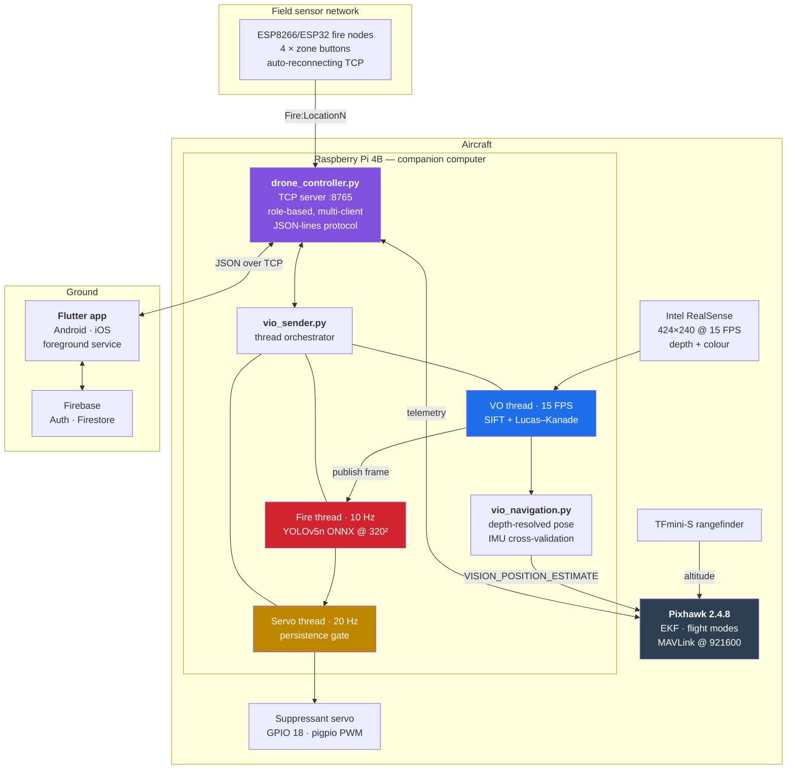
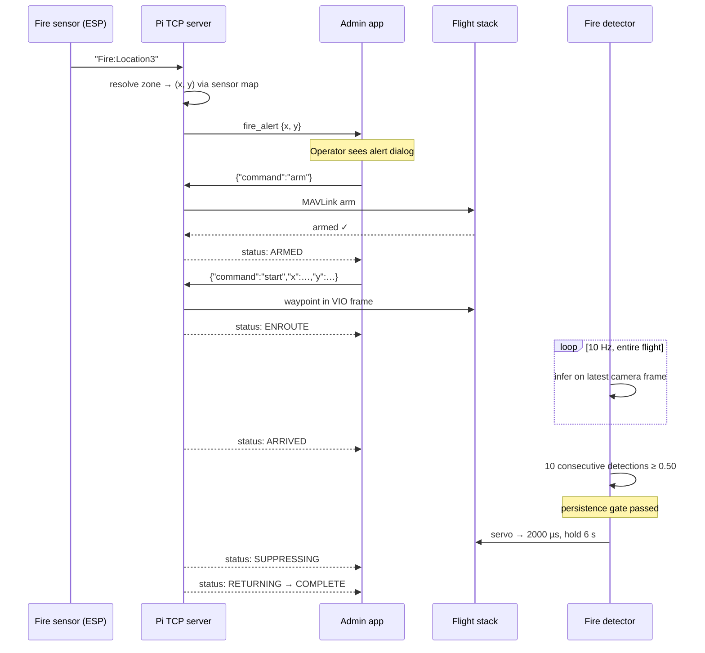

# Guardian

**A GPS-denied autonomous firefighting drone.**

Guardian flies, localizes, detects fire and drops suppressant **without a single satellite fix** — indoors, under canopy, and in urban canyons where GPS-guided aircraft simply cannot operate. Vision replaces GPS. A Raspberry Pi 4B replaces the ground station. A Flutter app in an operator's hand replaces the radio.

<p align="left">
  
  
  
  
  
  
  
  
</p>

📄 **[Full case study →](https://www.devlitix.com/case-study/guardian)** &nbsp;·&nbsp; 🔥 **[Fire detection model →](https://github.com/Husnaiin/Fire_Detector)**

---

## Table of Contents

- [The problem](#the-problem)
- [Results](#results)
- [System architecture](#system-architecture)
- [How a mission runs](#how-a-mission-runs)
- [GPS-denied navigation](#gps-denied-navigation)
- [Onboard fire detection](#onboard-fire-detection)
- [Payload release and safety gating](#payload-release-and-safety-gating)
- [Communication protocol](#communication-protocol)
- [The mobile ground station](#the-mobile-ground-station)
- [Hardware](#hardware)
- [Repository layout](#repository-layout)
- [Getting started](#getting-started)
- [Configuration reference](#configuration-reference)
- [Safety](#safety)
- [Roadmap](#roadmap)
- [Related repositories](#related-repositories)
- [License](#license)

---

## The problem

Firefighting drones are sold on the promise of removing humans from the most dangerous part of the job. Then they meet reality:

**GPS does not work where fires are most lethal to people.** Inside a warehouse, satellite signal is gone. Under dense forest canopy, it is attenuated and multipathed into uselessness. In an urban canyon between high-rises, reflections put the aircraft tens of metres from where it thinks it is. These are precisely the environments where you most want a machine to go instead of a person — and they are precisely where a GPS-guided drone will not hold position.

Worse, the conventional workaround is to keep a human pilot in visual line of sight, which puts a person back at the hazard boundary and caps response speed at how fast someone can get on scene with a controller.

**Guardian removes the satellite from the control loop entirely.** Position comes from the camera. The aircraft builds its own frame of reference from visual features, feeds a metric pose to the flight controller at EKF-acceptable rates, and navigates to coordinates in that self-built frame. A phone on the operator's belt receives telemetry and dispatches missions over Wi-Fi. No GPS lock is ever required, at any point in the flight.

---

## Results

| Metric | Result |
|---|---|
| Response time reduction vs. traditional methods | **60%** |
| Coverage area | **10 km²** |
| GPS-denied operation capability | **100%** |
| Flight endurance | **45 minutes** |

**Technical milestones**

- ✅ SIFT + optical-flow visual localization feeding Pixhawk `VISION_POSITION_ESTIMATE`
- ✅ Full MAVLink integration with Pixhawk 2.4.8 for hardware mission execution
- ✅ Cross-platform Flutter ground station (Android + iOS) deployed
- ✅ Multi-client Python TCP server with role-based access control, operational
- ✅ Onboard CPU-only fire detection at 10 Hz, concurrent with navigation
- ✅ GPIO servo suppressant release with temporal persistence gating
- ✅ Firebase authentication and cloud synchronization
- ✅ Android foreground service for persistent background monitoring

*Figures above are the published results from the [Guardian case study](https://www.devlitix.com/case-study/guardian).*

---

## System architecture

Guardian is three cooperating subsystems: an **aircraft** that thinks for itself, a **phone** that commands it, and a **sensor network** that wakes it up.



Everything inside the Pi runs as **cooperating daemon threads sharing state behind fine-grained locks** — one lock per concern (`vio_lock`, `color_frame_lock`, `fire_data_lock`, `range_lock`, `yaw_lock`, `battery_lock`, `armed_lock`, `flight_mode_lock`). No thread ever holds a lock across an expensive operation, so the navigation loop is never blocked by inference, telemetry, or a slow client socket.

---

## How a mission runs



The mission state machine is explicit and every transition is broadcast to connected clients:

`IDLE → ARMING → ARMED → IN_MISSION → ENROUTE → ARRIVED → SUPPRESSING → RETURNING → COMPLETE`

with `ERROR` and `ABORTING` reachable from any state. Status payloads carry `status`, `pose` `[x, y, z]`, `battery`, `armed`, `message` and an `errors` list — so the operator's screen is never guessing what the aircraft is doing.

---

## GPS-denied navigation

This is the core of the system. [`pi_backend/vio_navigation.py`](pi_backend/vio_navigation.py) turns a depth + colour stream into a metric pose the Pixhawk EKF will accept.

**The pipeline, per frame:**

1. **Feature detection** — `cv2.SIFT_create(nfeatures=1000)`. SIFT is chosen over ORB deliberately: it is scale- and rotation-invariant, which matters enormously on an aircraft that changes altitude and yaw constantly. It costs more CPU than ORB, and that cost is paid for with the tight compute budget enforced everywhere else in the system.
2. **Tracking** — Lucas–Kanade optical flow tracks features frame-to-frame, running *alongside* descriptor matching rather than instead of it. Two independent correspondence sources means a tracking failure in one is caught by the other.
3. **Depth resolution** — matched 2D points are lifted to metric 3D using the aligned RealSense depth frame, with **median filtering over a neighbourhood** rather than a single-pixel depth read. Depth sensors produce speckle and holes; taking a median of valid depths rejects both instead of injecting a garbage 3D point into the pose solve.
4. **Motion estimation** — the 3D correspondences give translation and rotation, integrated into a running pose in `[x_right, y_up, z_forward]` metres.
5. **IMU cross-validation** *(optional, `IMUValidator`)* — bias-corrected accelerometer integration produces an independent velocity estimate with damping, and a vision-implied velocity that disagrees with it beyond tolerance is rejected. This is the guard against the classic visual-odometry failure mode: a featureless white wall or a sudden flash producing a large, confident, completely wrong jump.
6. **Publication** — the pose is streamed to the Pixhawk as `VISION_POSITION_ESTIMATE` over MAVLink at 921600 baud, where it fuses into the EKF as the position source GPS would otherwise provide.

Selectable feature backends (`--feature_mode`): `sift` (SIFT + optical flow, default), `orb` (ORB + optical flow, cheaper), `optical_flow` (flow only, cheapest). Altitude is not trusted to vision at all — a **TFmini-S laser rangefinder** provides it directly, because ground clearance is the one number you never want a scale-ambiguous estimator to guess.

---

## Onboard fire detection

The detector is a **[YOLOv5n model trained in a separate repository](https://github.com/Husnaiin/Fire_Detector)** and deployed here as a frozen ONNX graph. Its full training, evaluation and edge-export story lives there; what follows is how it is *integrated*.

**The constraint:** there is one camera, one CPU, no GPU, and the navigation loop must never be starved. So the detector does not open the camera — **it subscribes to frames the odometry thread publishes.**

```python
# Producer: the VO thread. Publishes the newest colour frame; never waits.
if self.fire_detection:
    with self.color_frame_lock:
        self.latest_color_frame = color_image.copy()
```

```python
# Consumer: the fire thread. Copies under lock, releases, then infers.
with self.color_frame_lock:
    frame = self.latest_color_frame.copy()

out = fire_ort_sess.run([fire_ort_out], {fire_ort_in: img})[0]
...
time.sleep(1.0 / max(0.1, self.fire_fps))   # load governor
```

Three properties make this safe on a Pi 4B:

- **Rate decoupling.** The camera runs at 15 FPS and the odometry thread consumes *every* frame — dropping one breaks feature-tracking continuity. The detector runs at **10 Hz** on **latest-frame-wins** semantics: it may skip frames freely, because fire evolves over seconds, not milliseconds.
- **The lock is held for a `memcpy` only** — never across inference. The producer is never blocked by the consumer.
- **The `time.sleep()` rate limiter is the load governor.** It voluntarily returns the core to navigation ten times a second instead of spinning at 100% and starving the EKF feed.

Inference runs on **ONNX Runtime `CPUExecutionProvider`** — no PyTorch, no Ultralytics in the flight path. Pre-processing (BGR→RGB, resize to 320×320, `/255`, HWC→CHW) and greedy **NMS at IoU 0.45** are hand-written in NumPy against a fixed static-shape contract. Detection state is *published* behind `fire_data_lock` and polled by the servo controller and telemetry broadcaster, so no consumer is coupled to inference timing.

An Ultralytics `.pt` path exists as a bench-development fallback (`--fire_model_path` ending in `.pt`), and `--fire_window_visualization` renders annotated frames for ground testing — **never enable it in flight; the render steals the core.**

---

## Payload release and safety gating

Suppressant is single-shot and irreversible. The release logic reflects that.

The servo thread runs at 20 Hz and requires **`servo_persist_frames` consecutive detections** at or above `servo_trigger_threshold` before it actuates. At the default of 10 detections and 10 Hz inference, that is **roughly one full second of unbroken agreement** that fire is present.

```python
if fire_now:
    consecutive += 1
else:
    consecutive = 0                     # any miss resets the counter

if consecutive >= int(self.servo_persist_frames):
    active_until = now + float(self.servo_hold_time)
    consecutive = 0
    print("== FIRE PERSISTENT: ACTIVATING SERVO ==")
```

**Why the gate exists.** A single high-confidence frame is not a fire. It is a sun glare off a windshield, a red jacket, a brake light, a hot reflection off water. Any one of those can produce a confident detection for one frame — and none of them should cost the mission its payload. The counter resets completely on a single non-detection, so only *sustained* evidence actuates hardware.

PWM is generated by **`pigpio`**, not software timing: idle at **1000 µs**, active at **2000 µs**, held for **6 s** by default. `pigpio` uses DMA-driven hardware timing, so servo pulses stay clean even while both vision pipelines are loading the CPU — software PWM would jitter under exactly this load and could mis-drive the release. The daemon must be running (`sudo pigpiod`); if it is not, the servo subsystem disables itself and logs a warning rather than failing silently or pretending to arm.

---

## Communication protocol

A **newline-delimited JSON protocol over raw TCP**, served on port `8765` by [`pi_backend/drone_controller.py`](pi_backend/drone_controller.py). Raw TCP rather than HTTP or MQTT: no broker to keep alive, no request/response overhead per telemetry tick, and a socket whose liveness is directly observable — which is what you want over an ESP-hosted Wi-Fi hotspot in an emergency.

**Role-based access control.** Clients identify themselves on connect, and the server tracks each socket's role:

| Role | Capability |
|---|---|
| `admin` | Full flight authority — arm, dispatch, loiter, land, abort, mapping, recording |
| `external_client` | Report fires and observe status. **Cannot fly the aircraft.** |

Fire alerts from external clients are **forwarded to every connected admin** rather than acted on automatically — a human authorizes flight.

**Commands**

| Command | Payload | Effect |
|---|---|---|
| `identify` | `client_type` | Register role for this socket |
| `arm` / `disarm` | — | MAVLink arm/disarm, confirmed by readback |
| `start` | `x`, `y` | Dispatch to coordinates in the VIO frame |
| `fire_alert` | `x`, `y` | Report a fire; broadcast to admins |
| `loiter` | `altitude`, `duration` | Hold position at altitude |
| `land` | — | Controlled descent |
| `abort` | — | Immediate mission abort |
| `check_ekf` | — | Query EKF health before committing to flight |
| `build_map` / `save_map` / `load_map` | — | VIO map lifecycle |
| `start_record` / `stop_record` | — | Onboard video capture |
| `update_sensor_map` | `sensor_map` | Rebind sensor zones → coordinates |

**Plain-text fire tokens.** The ESP nodes are microcontrollers with no JSON serializer, so the server also accepts bare tokens like `Fire:Location3` and resolves them against the sensor map into coordinates. A four-button ESP8266 sketch ([`pi_backend/fire_client.ino`](pi_backend/fire_client.ino)) implements this, with **periodic Wi-Fi and TCP reconnection loops** — a field node that loses the hotspot must rejoin unattended, so reconnection is checked every 2 s and 3 s respectively rather than assumed.

---

## The mobile ground station

A Flutter app targeting **Android and iOS** from one codebase — because in an emergency you use the phone that is in your pocket.

**Screens** — login / signup (Firebase Auth, Google and Facebook sign-in), admin home with live telemetry, client home, coordinate input with map selection, mission status.

**Widgets, each mapped to a real operational need**

| Widget | Purpose |
|---|---|
| `connection_widget` | Socket state — the first thing an operator must be able to trust |
| `drone_status_widget` | Live state, pose, battery, errors |
| `control_buttons_widget` | Arm, dispatch, abort |
| `map_control_widget` | Tap-to-dispatch coordinate selection |
| `check_ekf_widget` | EKF health **before** committing to flight |
| `loiter_land_widget` | Altitude/duration hold and controlled landing |
| `fire_alert_dialog` | Interrupting alert when a sensor node reports fire |
| `sensor_mapping_card` | Bind sensor zones to coordinates in the field |
| `admin_push_settings_card` | Notification routing control |
| `video_record_widget` | Start/stop onboard capture |

**Background operation** is treated as a hard requirement, not a nicety. [`lib/foreground_service.dart`](lib/foreground_service.dart) with `flutter_foreground_task` keeps the socket and alert pipeline alive when the app is not in the foreground, and `flutter_local_notifications` surfaces fire alerts through a locked screen. An operator who misses an alert because Android killed a background socket is an operator who was not warned — so the service is explicitly foregrounded and survives.

**Stack:** `provider` + `flutter_bloc` for state, `equatable` for value semantics, `firebase_core` / `firebase_auth` / `cloud_firestore` for identity and sync, `shared_preferences` for local persistence.

---

## Hardware

| Component | Part | Role |
|---|---|---|
| Flight controller | **Pixhawk 2.4.8** | EKF, flight modes, actuator output |
| Companion computer | **Raspberry Pi 4B** | Vision, fire detection, TCP server |
| Camera | **Intel RealSense** (424×240 @ 15 FPS) | Depth + colour for VIO and detection |
| Rangefinder | **TFmini-S** | Direct altitude / ground clearance |
| Link | **ESP32 / ESP8266** | Wi-Fi hotspot, field fire-alert nodes |
| Airframe | Multi-rotor quadcopter | 45-minute endurance class |
| Power | Lithium-polymer pack | Flight + Pi + payload |
| Payload | GPIO servo (**GPIO 18**, `pigpio` PWM) | Suppressant release |
| Serial | MAVLink over `/dev/ttyACM0` @ **921600** | Pi ↔ Pixhawk |

---

## Repository layout

```
Guardian/
├── lib/                              # Flutter ground station
│   ├── main.dart
│   ├── foreground_service.dart       # persistent background monitoring
│   ├── models/                       # command, coordinates, drone_status
│   ├── screens/                      # login, signup, home, client, coords, mission
│   ├── services/
│   │   ├── socket_service.dart       # TCP client, JSON-lines protocol
│   │   ├── drone_service.dart        # command dispatch + telemetry state
│   │   ├── notification_service.dart # local notifications for alerts
│   │   └── sensor_map_service.dart   # zone → coordinate bindings
│   └── widgets/                      # telemetry, controls, alerts, mapping
│
├── pi_backend/                       # Onboard (Raspberry Pi 4B)
│   ├── drone_controller.py           # TCP server, roles, mission state machine
│   ├── vio_sender.py                 # thread orchestrator: VO · fire · servo · MAVLink
│   ├── vio_navigation.py             # SIFT + optical flow + depth → metric pose
│   ├── fire_client.ino               # ESP8266 field fire-alert node
│   └── requirements.txt
│
├── setup.sh / setup.bat              # guided environment setup
└── pubspec.yaml
```

> **Note:** `guardian_app/` contains an earlier nested copy of the Flutter project retained for history. The active app is the top-level `lib/` + `pubspec.yaml`.

---

## Getting started

### 1. Mobile app

```bash
git clone https://github.com/Husnaiin/Guardian.git
cd Guardian

flutter pub get
flutter devices
flutter run
```

Or use the guided script: `./setup.sh` (Linux/macOS) · `setup.bat` (Windows).

Firebase: supply your own `android/app/google-services.json` and iOS `GoogleService-Info.plist`, and enable **Email/Password**, **Google** and **Facebook** providers in the Firebase console.

### 2. Raspberry Pi backend

```bash
# On the Pi
pip install -r pi_backend/requirements.txt
pip install pymavlink pyrealsense2 opencv-python numpy onnxruntime pigpio

sudo pigpiod                      # hardware-timed servo PWM
```

Deploy the fire model from **[Fire_Detector](https://github.com/Husnaiin/Fire_Detector)**:

```bash
scp best.onnx guardian@<pi>:/home/guardian/Desktop/capture_depth/fire_model/best.onnx
```

### 3. Launch the aircraft stack

```bash
python pi_backend/drone_controller.py        # TCP server on :8765
```

Or run the vision/flight stack directly for bench testing:

```bash
python pi_backend/vio_sender.py \
  --pixhawk true \
  --pixhawk_device /dev/ttyACM0 \
  --pixhawk_baud 921600 \
  --fire_detection true \
  --fire_model_path /home/guardian/Desktop/capture_depth/fire_model/best.onnx \
  --fire_threshold 0.50 \
  --fire_fps 10 \
  --fire_imgsz 320 \
  --servo_enable true \
  --servo_gpio 18 \
  --servo_persist_frames 10 \
  --servo_hold_time 6.0
```

The backend runs in **simulation mode** automatically if `VIOSender` cannot initialize (no camera or no Pixhawk attached), so the app and protocol can be developed on a desktop.

### 4. Field nodes

Flash [`pi_backend/fire_client.ino`](pi_backend/fire_client.ino) to an ESP8266, set `ssid` / `password` / `serverHost` / `serverPort` to match the drone's hotspot, and wire four buttons to `D1`–`D4` as zone triggers.

---

## Configuration reference

| Flag | Default | Description |
|---|---|---|
| `--pixhawk` | `true` | Enable MAVLink connection |
| `--pixhawk_device` | `/dev/ttyACM0` | Serial device |
| `--pixhawk_baud` | `921600` | Serial baud rate |
| `--fire_detection` | `false` | Enable the detector thread |
| `--fire_model_path` | `.../fire_model/best.onnx` | `.onnx` → ONNX Runtime; `.pt` → Ultralytics (dev) |
| `--fire_threshold` | `0.50` | Detection confidence floor |
| `--fire_fps` | `10.0` | **Load governor** — raise it and you spend navigation headroom |
| `--fire_imgsz` | `320` | Must match the exported model resolution |
| `--fire_persist_frames` | `2` | Temporal smoothing on reported detection state |
| `--fire_window_visualization` | `false` | Bench debug only — **never in flight** |
| `--servo_enable` | `false` | Enable payload release |
| `--servo_gpio` | `18` | BCM pin (or `--servo_physical_pin` for board numbering) |
| `--servo_trigger_threshold` | = `fire_threshold` | Confidence required to count toward the gate |
| `--servo_persist_frames` | `10` | **Consecutive detections required to actuate** |
| `--servo_hold_time` | `6.0` | Seconds the release is held open |
| `--servo_active_pw` / `--servo_idle_pw` | `2000` / `1000` µs | Servo pulse widths |
| `--visualize_odom` | `false` | Odometry visualization (bench only) |

---

## Safety

This is a flying machine that carries a payload and actuates hardware from a model's output. Treat it accordingly.

- **Human-in-the-loop by design.** Fire alerts are forwarded to an admin, not auto-flown. Only `admin` clients can arm or dispatch.
- **Failsafes are first-class commands** — `abort`, `land` and `disarm` are available from any state, surfaced as dedicated controls in the app.
- **Check EKF health before committing.** `check_ekf` exists precisely because a vision-fed EKF that has not converged must not be flown.
- **Never enable visualization flags in flight.** They consume the core the navigation loop depends on.
- **Test the release on the bench first,** with `--servo_enable true` and `--pixhawk false`, before any payload is loaded on an airframe.
- **Comply with local UAS regulations.** Autonomous BVLOS flight is restricted or prohibited in many jurisdictions.

---

## Roadmap

- [ ] INT8 quantization of the fire model for additional CPU headroom (see [Fire_Detector](https://github.com/Husnaiin/Fire_Detector))
- [ ] Loop closure and drift correction in the VIO frame for longer missions
- [ ] Fuse detections with VIO pose to emit **geolocated** fire coordinates, not image-space boxes
- [ ] Smoke detection as an early-warning class — smoke is visible before flame from altitude
- [ ] Multi-drone coordination over the same TCP server
- [ ] Onboard mission recording and post-flight replay in the app
- [ ] TLS on the control channel

---

## Related repositories

| Repository | Role |
|---|---|
| **Husnaiin/Guardian** *(this repo)* | Flight system — Flutter ground station, Pi backend, VIO navigation, MAVLink integration, payload control |
| **[Husnaiin/Fire_Detector](https://github.com/Husnaiin/Fire_Detector)** | Training, evaluation and edge-export of the YOLOv5n fire detection model that runs onboard |
| [Guardian case study](https://www.devlitix.com/case-study/guardian) | System-level write-up, architecture and results |

The two repositories describe **one aircraft.** History is split so the model's training lineage and the flight software's lineage stay independently readable — not because the systems are separable.

---

## Acknowledgements

- [Pixhawk](https://pixhawk.org/) / [MAVLink](https://mavlink.io/) / [pymavlink](https://github.com/ArduPilot/pymavlink) — flight control and protocol
- [Intel RealSense SDK](https://github.com/IntelRealSense/librealsense) — depth + colour streaming
- [OpenCV](https://opencv.org/) — SIFT, optical flow, image processing
- [ONNX Runtime](https://onnxruntime.ai/) — CPU inference on the edge
- [pigpio](https://abyz.me.uk/rpi/pigpio/) — DMA-timed hardware PWM
- [Flutter](https://flutter.dev/) & [Firebase](https://firebase.google.com/) — cross-platform ground station

---

## License

Released under the **MIT License**.

The onboard fire detection model is derived from Ultralytics YOLOv5 (**AGPL-3.0**) and a **CC BY 4.0** dataset — review both before commercial deployment. See [Fire_Detector](https://github.com/Husnaiin/Fire_Detector) for details.

---

<p align="center">
<i>No GPS. No GPU. No second chance.</i><br>
<sub><a href="https://www.devlitix.com/case-study/guardian">Case study</a> · <a href="https://github.com/Husnaiin/Fire_Detector">Fire detection model</a></sub>
</p>
