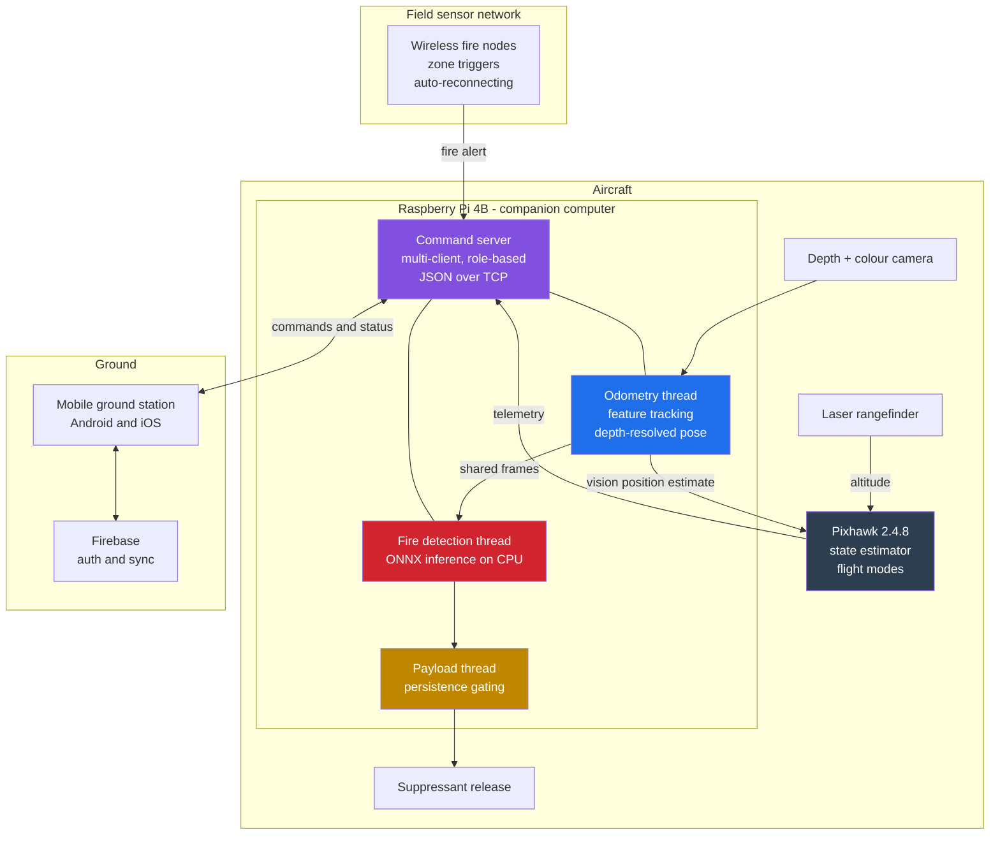
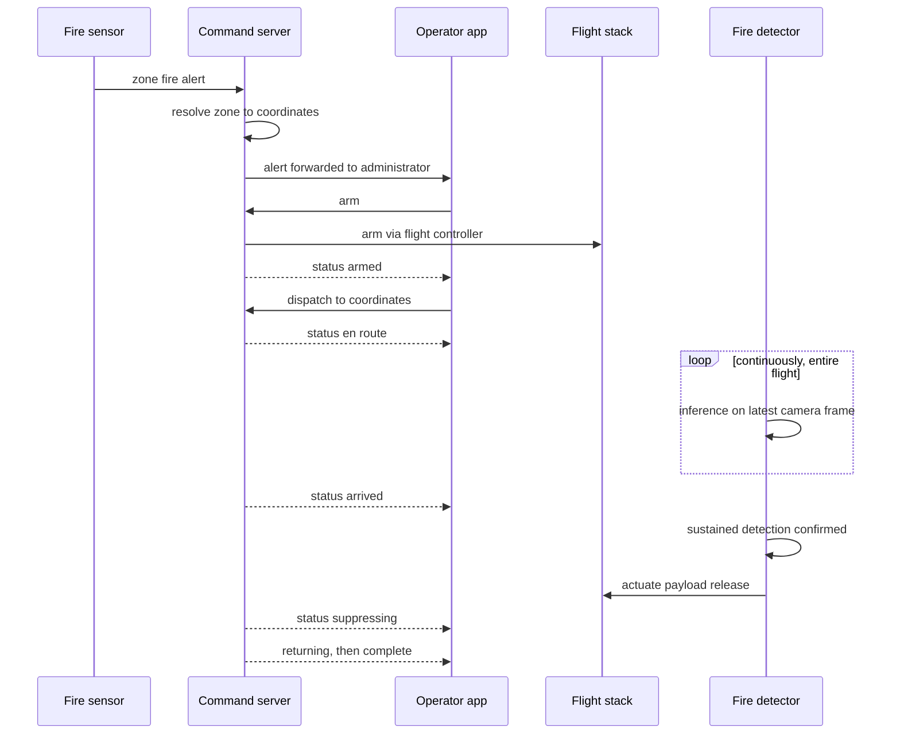

# Guardian

**A GPS-denied autonomous firefighting drone.**

  
  
  
  
  
  
  
  

Guardian flies, localizes, detects fire and delivers suppressant without a single satellite fix — indoors, under canopy, and in urban canyons where GPS-guided aircraft cannot operate. Vision replaces GPS. A Raspberry Pi replaces the ground station. A phone in the operator's hand replaces the radio.

[Case study](https://www.devlitix.com/case-study/guardian) &middot; [Fire detection model](https://github.com/Husnaiin/Fire_Detector)

---

## Contents

- [The problem](#the-problem)
- [Results](#results)
- [Capabilities](#capabilities)
- [System architecture](#system-architecture)
- [How a mission runs](#how-a-mission-runs)
- [GPS-denied navigation](#gps-denied-navigation)
- [Onboard fire detection](#onboard-fire-detection)
- [Payload release and safety gating](#payload-release-and-safety-gating)
- [Communication](#communication)
- [Mobile ground station](#mobile-ground-station)
- [Hardware](#hardware)
- [Repository layout](#repository-layout)
- [Prerequisites](#prerequisites)
- [Installation](#installation)
- [Usage](#usage)
- [Configuration](#configuration)
- [Troubleshooting](#troubleshooting)
- [Safety](#safety)
- [Roadmap](#roadmap)
- [Contributing](#contributing)
- [Related repositories](#related-repositories)
- [License](#license)

---

## The problem

Firefighting drones are sold on the promise of removing people from the most dangerous part of the job. Then they meet reality.

GPS does not work where fires are most lethal to humans. Inside a warehouse, signal is gone. Under dense forest canopy it is attenuated and multipathed into uselessness. In an urban canyon, reflections place the aircraft tens of metres from where it believes it is. These are exactly the environments where a machine should go instead of a person, and exactly where a GPS-guided drone will not hold position. The conventional workaround — keeping a pilot in visual line of sight — puts a human back at the hazard boundary and caps response speed at how fast someone can reach the scene.

Guardian removes the satellite from the control loop entirely. Position comes from the camera. The aircraft builds its own frame of reference from visual features, feeds a metric pose to the flight controller at rates its state estimator will accept, and navigates to coordinates within that self-built frame. A mobile application receives telemetry and dispatches missions over a local wireless link. No GPS lock is required at any point in the flight.

---

## Results

| Metric | Result |
|---|---|
| Response time reduction versus traditional methods | 60% |
| Coverage area | 10 km² |
| GPS-denied operation capability | 100% |
| Flight endurance | 45 minutes |

Figures published in the [Guardian case study](https://www.devlitix.com/case-study/guardian).

---

## Capabilities

- **GPS-denied flight.** Visual-inertial localization feeding the flight controller's state estimator, with no dependence on satellite positioning at any phase of the mission.
- **Autonomous dispatch.** A coordinate selected on a map becomes an executed waypoint in the aircraft's own reference frame.
- **Onboard fire detection.** CPU-only inference running concurrently with navigation, sharing a single camera stream.
- **Vision-confirmed payload release.** Suppressant is released only on sustained visual confirmation, never on a single frame.
- **Field sensor network.** Low-cost wireless nodes report fires by zone and wake the system without an operator present.
- **Role-based command authority.** Full flight control for administrators; reporting and observation only for external clients.
- **Persistent monitoring.** A background service keeps the alert pipeline alive when the application is not in the foreground.
- **Failsafes throughout.** Abort, land and disarm are reachable from any mission state.

---

## System architecture

Guardian is three cooperating subsystems: an aircraft that thinks for itself, a phone that commands it, and a sensor network that wakes it up.

Everything aboard the aircraft runs as cooperating daemon threads sharing state behind fine-grained locks, one per concern. No thread holds a lock across an expensive operation, so the navigation loop is never blocked by inference, by telemetry, or by a slow client connection.

---

## How a mission runs

The mission state machine is explicit, and every transition is broadcast to connected clients: idle, arming, armed, in mission, en route, arrived, suppressing, returning, complete — with error and aborting reachable from any state. Status messages carry the current state, pose, battery level, arming status and any active errors, so the operator's screen is never guessing what the aircraft is doing.

---

## GPS-denied navigation

This is the core of the system. The onboard navigation module turns a depth and colour stream into a metric pose the flight controller's state estimator will accept.

Scale- and rotation-invariant features are detected in each frame and tracked between frames by optical flow, running alongside descriptor matching rather than instead of it — two independent correspondence sources mean a tracking failure in one is caught by the other. Matched points are lifted into metric 3D using the aligned depth frame, with median filtering across a neighbourhood rather than a single-pixel depth read, because depth sensors produce speckle and holes and a naive read injects a corrupted point into the pose solve. The resulting correspondences yield translation and rotation, integrated into a running pose and streamed to the flight controller as a vision position estimate, where it fuses into the state estimator as the position source that GPS would otherwise provide.

An optional inertial cross-check guards the classic visual-odometry failure mode. Bias-corrected accelerometer integration produces an independent velocity estimate, and a vision-implied velocity that disagrees with it beyond tolerance is rejected — the defence against a featureless wall or a sudden flash producing a large, confident and entirely wrong jump.

Three feature backends are selectable, trading accuracy against processor load. Altitude is deliberately not trusted to vision at all; a laser rangefinder supplies it directly, because ground clearance is the one measurement that should never come from a scale-ambiguous estimator.

---

## Onboard fire detection

The detector is a compact single-class model trained in a [separate repository](https://github.com/Husnaiin/Fire_Detector) and deployed here as a frozen inference graph.

The constraint is severe: one camera, one processor, no GPU, and a navigation loop that must never be starved. So the detector does not open the camera. It subscribes to frames the odometry thread publishes into shared memory.

Rate decoupling makes this safe. The camera streams at fifteen frames per second and the odometry thread consumes every one of them, because dropping a frame breaks tracking continuity. The detector, watching a phenomenon that evolves over seconds rather than milliseconds, runs at ten hertz on latest-frame-wins semantics, free to skip frames the odometry cannot. The shared buffer's lock is held only for a memory copy and never across inference, so the producer is never blocked by the consumer. And the detector's rate limiter acts as a load governor, voluntarily returning the processor to navigation ten times a second rather than spinning at full occupancy.

Inference runs on a CPU execution provider with no training framework in the flight path, and detection state is published behind its own lock for the payload controller and telemetry broadcaster to poll — so no consumer is coupled to inference timing. A development fallback path and an annotated visualization mode exist for bench testing; the visualization must never be enabled in flight, because the render consumes the core navigation depends on.

---

## Payload release and safety gating

Suppressant is single-shot and irreversible, and the release logic reflects that.

The payload thread requires a run of consecutive detections above threshold before it actuates — roughly a full second of unbroken agreement at the default configuration — and the counter resets completely on a single non-detection. A single high-confidence frame is not a fire. It is sun glare off a windshield, a red jacket, a brake light, a reflection off water. Any of those can produce a confident detection for one frame, and none should cost the mission its payload. Only sustained evidence actuates hardware.

Servo pulses are generated by DMA-driven hardware timing rather than software loops, so they stay clean while both vision pipelines load the processor — software timing would jitter under exactly this load and could mis-drive the release. If the timing daemon is unavailable the payload subsystem disables itself and logs a warning rather than failing silently or pretending to be armed.

---

## Communication

A newline-delimited JSON protocol over raw TCP, served by the onboard command server. Raw TCP rather than HTTP or a message broker: nothing extra to keep alive, no per-message request overhead on a continuous telemetry stream, and a connection whose liveness is directly observable — which is what matters over a field wireless link in an emergency.

Clients identify their role on connection, and the server enforces it.

| Role | Authority |
|---|---|
| Administrator | Full flight authority — arm, dispatch, loiter, land, abort, mapping, recording |
| External client | Report fires and observe status. Cannot fly the aircraft. |

Fire alerts from external clients are forwarded to every connected administrator rather than acted on automatically. A human authorizes flight.

The command surface covers identification, arming and disarming, coordinate dispatch, fire alerting, loiter with altitude and duration, landing, mission abort, state-estimator health checks, map building and persistence, onboard recording, and sensor-zone rebinding.

The field nodes are microcontrollers with no JSON serializer, so the server also accepts bare zone tokens and resolves them against the sensor map into coordinates. Those nodes run continuous wireless and connection recovery loops, because a field node that loses the link must rejoin unattended rather than assume it is still connected.

---

## Mobile ground station

A Flutter application targeting Android and iOS from one codebase, because in an emergency you use the phone already in your pocket.

The interface covers authentication with federated sign-in, an administrator console with live telemetry, a client view, map-based coordinate selection, and mission status. Individual controls map to real operational needs: connection state, live pose and battery, arm and dispatch, tap-to-dispatch mapping, state-estimator health checks before committing to flight, loiter and controlled landing, an interrupting dialog when a sensor node reports fire, in-field sensor zone binding, notification routing, and onboard video capture.

Background operation is treated as a hard requirement rather than a convenience. A foreground service keeps the connection and alert pipeline alive when the application is not in view, and local notifications surface fire alerts through a locked screen. An operator who misses an alert because the platform killed a background connection is an operator who was not warned.

---

## Hardware

| Component | Part | Role |
|---|---|---|
| Flight controller | Pixhawk 2.4.8 | State estimation, flight modes, actuator output |
| Companion computer | Raspberry Pi 4B | Vision, fire detection, command server |
| Camera | Intel RealSense | Depth and colour for navigation and detection |
| Rangefinder | TFmini-S laser | Direct altitude and ground clearance |
| Wireless | ESP32 / ESP8266 | Field hotspot and fire-alert nodes |
| Airframe | Multi-rotor quadcopter | 45-minute endurance class |
| Power | Lithium-polymer pack | Flight, computer and payload |
| Payload | GPIO servo, hardware-timed PWM | Suppressant release |
| Link | MAVLink over serial | Companion computer to flight controller |

---

## Repository layout

| Path | Contents |
|---|---|
| `lib/` | Flutter ground station |
| `lib/models/` | Command, coordinate and drone status models |
| `lib/screens/` | Authentication, administrator and client consoles, coordinate input, mission status |
| `lib/services/` | Socket client, command dispatch and telemetry, notifications, sensor-zone mapping |
| `lib/widgets/` | Telemetry, flight controls, alerts, mapping and recording controls |
| `lib/foreground_service.dart` | Persistent background monitoring |
| `pi_backend/drone_controller.py` | Command server, role enforcement, mission state machine |
| `pi_backend/vio_sender.py` | Thread orchestrator for navigation, detection, payload and flight-controller links |
| `pi_backend/vio_navigation.py` | Feature tracking and depth-resolved pose estimation |
| `pi_backend/fire_client.ino` | Field fire-alert node firmware |
| `setup.sh`, `setup.bat` | Guided environment setup |

The `guardian_app/` directory contains an earlier nested copy of the Flutter project retained for history. The active application is the top-level `lib/` and `pubspec.yaml`.

---

## Prerequisites

**For the mobile application.** The Flutter SDK on a recent stable channel with Dart 3.0 or newer, plus the platform toolchain for whichever target you build — Android Studio and its SDK, or Xcode for iOS. A Firebase project of your own is required; the credentials committed here will not authenticate against it.

**For the onboard backend.** A Raspberry Pi 4B running a 64-bit OS, Python 3.9 or newer, a depth camera, and a Pixhawk flight controller reachable over serial. The backend degrades gracefully: if the camera or flight controller is absent it enters simulation mode, so the application and protocol can be developed entirely on a desktop before any hardware exists.

**For the field nodes.** An ESP8266 or ESP32 with the Arduino toolchain and four momentary buttons.

---

## Installation

### Mobile application

    git clone https://github.com/Husnaiin/Guardian.git
    cd Guardian
    flutter pub get
    flutter devices

Guided setup scripts are provided for both host families and will check the toolchain, install dependencies and offer device selection:

    ./setup.sh        # Linux and macOS
    setup.bat         # Windows

Supply your own Firebase credentials — `google-services.json` for Android and `GoogleService-Info.plist` for iOS — and enable the email, Google and Facebook sign-in providers in the Firebase console.

### Onboard backend

On the Raspberry Pi:

    pip install -r pi_backend/requirements.txt
    pip install pymavlink pyrealsense2 opencv-python numpy onnxruntime pigpio

Start the timing daemon used for hardware-timed servo pulses, and enable it at boot so the payload subsystem survives a power cycle:

    sudo pigpiod
    sudo systemctl enable pigpiod

Deploy the exported detection model from the [Fire_Detector](https://github.com/Husnaiin/Fire_Detector) repository:

    scp best.onnx guardian@<pi-address>:/home/guardian/Desktop/capture_depth/fire_model/best.onnx

---

## Usage

### Running the aircraft

Starting the command server brings up the full stack — navigation, detection, payload control and the flight-controller link — and listens for client connections:

    python pi_backend/drone_controller.py

### Bench testing

The vision and flight stack can be launched directly, with each subsystem independently enabled, which is how you should verify a build before it flies:

    python pi_backend/vio_sender.py \
        --pixhawk true --pixhawk_device /dev/ttyACM0 --pixhawk_baud 921600 \
        --fire_detection true --fire_threshold 0.50 --fire_fps 10 \
        --servo_enable true --servo_gpio 18 --servo_persist_frames 10

Test the payload release with the flight-controller link disabled and no suppressant loaded:

    python pi_backend/vio_sender.py --pixhawk false --fire_detection true --servo_enable true

Verify navigation in isolation, with detection off, to rule the detector out when diagnosing pose problems:

    python pi_backend/vio_sender.py --fire_detection false --visualize_odom true

### Running the application

    flutter run                       # against a connected device
    flutter build apk --release       # Android release build

On first launch, sign in, then connect to the aircraft's wireless hotspot and enter the server address. Administrators receive full flight authority; external clients can report fires and observe status only.

### Field nodes

Flash `pi_backend/fire_client.ino` to the microcontroller with the Arduino IDE, setting the hotspot credentials and server address to match the aircraft, and wire zone trigger buttons to pins D1 through D4. The node rejoins the network and reconnects on its own if the link drops.

---

## Configuration

Runtime behaviour is set through command-line options on the onboard stack, grouped by subsystem.

| Group | Controls |
|---|---|
| Flight controller | Connection enable, serial device, baud rate |
| Fire detection | Enable, model path, confidence threshold, inference rate, input size, temporal smoothing |
| Payload | Enable, GPIO pin selection, trigger threshold, persistence frames, hold duration, pulse widths |
| Diagnostics | Odometry and detection visualization, for bench use only |

The inference rate is the primary load governor. Raising it spends headroom the navigation loop depends on, and it should be treated as a flight-safety parameter rather than a tuning knob.

---

## Troubleshooting

| Symptom | Cause and resolution |
|---|---|
| Backend reports simulation mode | The camera or flight controller could not be initialized. Check the serial device path and that the camera is enumerated. |
| No connection to the flight controller | Wrong serial device or baud rate, or the port is held by another process such as a ground-control station. |
| Payload never actuates | The timing daemon is not running, or the detection run required by the persistence gate is never sustained. Start the daemon and verify detections on the bench first. |
| Servo pulses jitter | Software timing is being used in place of hardware timing. Confirm the daemon is running rather than falling back. |
| Position drifts or jumps | Insufficient visual texture in the scene, or degraded depth. Verify the scene has trackable features and enable inertial cross-validation. |
| Aircraft refuses to hold position | The state estimator has not converged on the vision source. Check estimator health before arming rather than after. |
| Navigation degrades once detection is enabled | The inference rate is set too high, or a visualization option is enabled in flight. |
| Application connects then drops | Background execution is being suspended by the platform. Confirm the foreground service is permitted to run. |

---

## Safety

This is a flying machine that carries a payload and actuates hardware from a model's output. Treat it accordingly.

- Fire alerts are forwarded to an operator, not auto-flown. Only administrators can arm or dispatch.
- Abort, land and disarm are first-class commands available from any mission state and surfaced as dedicated controls.
- Verify state-estimator health before committing to flight. A vision-fed estimator that has not converged must not be flown.
- Never enable visualization options in flight; they consume the core the navigation loop depends on.
- Test payload release on the bench, with the flight-controller link disabled, before loading suppressant on an airframe.
- Comply with local unmanned aircraft regulations. Autonomous flight beyond visual line of sight is restricted or prohibited in many jurisdictions.

---

## Roadmap

- Quantized fire detection for additional processor headroom
- Loop closure and drift correction for longer missions in the visual reference frame
- Geolocated fire coordinates fused from detection and pose, rather than image-space boxes
- Smoke detection as an early-warning class, since smoke is visible before flame from altitude
- Multi-drone coordination across a shared command server
- Onboard mission recording with post-flight replay in the application
- Transport encryption on the control channel

---

## Contributing

Contributions are welcome. Open an issue before starting substantial work so the approach can be discussed first.

Two constraints govern changes to the onboard stack. Anything running on the companion computer shares a processor with the navigation loop, so a contribution that adds continuous work must account for what it costs that loop — the aircraft has no headroom to spare. And anything touching arming, dispatch or payload release is flight-safety code: it needs bench verification with the flight-controller link disabled and no payload loaded, and that verification should be described in the pull request.

Changes to the application should preserve the role boundary. External clients report and observe; only administrators fly the aircraft, and that separation is a safety property rather than a UI convention.

---

## Related repositories

| Repository | Role |
|---|---|
| Husnaiin/Guardian | This repository. Flight system — ground station, onboard backend, navigation, flight-controller integration and payload control. |
| [Husnaiin/Fire_Detector](https://github.com/Husnaiin/Fire_Detector) | Training, evaluation and edge export of the fire detection model that runs onboard |
| [Guardian case study](https://www.devlitix.com/case-study/guardian) | System-level write-up, architecture and results |

The two repositories describe one aircraft. History is split so that the model's training lineage and the flight software's lineage stay independently readable, not because the systems are separable.

---

## Acknowledgements

- [Pixhawk](https://pixhawk.org/) and [MAVLink](https://mavlink.io/) for flight control and protocol
- [Intel RealSense](https://github.com/IntelRealSense/librealsense) for depth and colour streaming
- [OpenCV](https://opencv.org/) for feature detection, optical flow and image processing
- [ONNX Runtime](https://onnxruntime.ai/) for edge inference
- [pigpio](https://abyz.me.uk/rpi/pigpio/) for hardware-timed PWM
- [Flutter](https://flutter.dev/) and [Firebase](https://firebase.google.com/) for the cross-platform ground station

---

## License

Released under the MIT License.

The onboard fire detection model derives from tooling licensed AGPL-3.0 and a dataset licensed CC BY 4.0. Review both before commercial deployment; see [Fire_Detector](https://github.com/Husnaiin/Fire_Detector) for details.

---

<i>No GPS. No GPU. No second chance.</i> 
<a href="https://www.devlitix.com/case-study/guardian">Case study</a> &middot; <a href="https://github.com/Husnaiin/Fire_Detector">Fire detection model</a>

